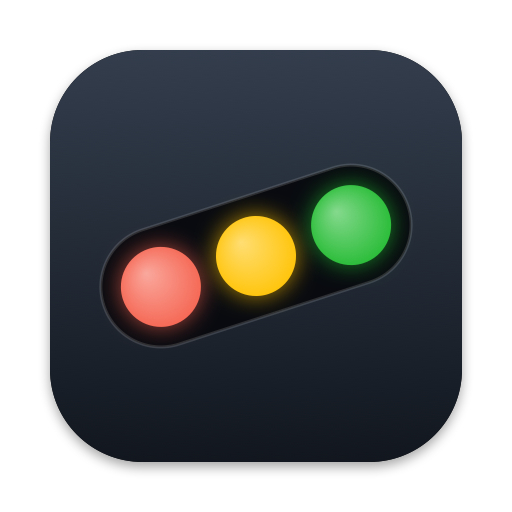

# TiltBar

macOS menu bar status for a running `tilt up`. Shows the same red / yellow / green
counts as the Tilt web UI header, lists resources that need a human (failed updates,
manual-trigger resources with unapplied changes), and lets you trigger them from the
dropdown. It can also start, stop, and restart `tilt up` for Tiltfiles you've used before.

    ✕ 2  ⚙ 1  ✓ 63/66

By default the item is compact: one segment for the worst state, so `✕ 2` when
anything is failing, `⚙ 1` when something is pending or building, and a lone green
`✓` when all is well. Turn off **Compact icon** in the menu for the full spread above.

## Build and run

    make install     # builds dist/TiltBar.app and copies it to /Applications
    open /Applications/TiltBar.app

`make run` opens the freshly built copy from `dist/` instead. `make stop` kills it.
Requires the Xcode command line tools (SwiftPM + AppKit); no Xcode project needed.
The app icon is drawn by `Icon/make-icon.swift`; `make icon` regenerates `Icon/AppIcon.icns` and `Icon/AppIcon.png`.

## How it talks to Tilt

- Status is polled every 2s from Tilt's apiserver (`uiresources`). Address and
  bearer token are read from `~/.tilt-dev/config`, which `tilt up` rewrites each run.
- Triggers POST to the web server at `localhost:10350/api/trigger`, using the
  session token the web UI receives as the `Tilt-Token` cookie. A stale token is
  refreshed automatically after a Tilt restart.
- "Open in Tilt UI" opens `localhost:10350/r/<resource>/overview`.
- The running Tiltfile's path and args are read from the apiserver (`tiltfiles/(Tiltfile)`)
  and remembered as a recent, so a Tilt you started in a terminal shows up there too.

The menu bar shows `◦ tilt off` in gray when the apiserver is unreachable (just `◦`
in compact mode).

## Menu

- Summary line and **Open Tilt UI** (⌘O)
- **Needs attention**: resources in error or with pending changes. Each resource is a
  submenu with its status line, a trigger action ("Apply pending changes", "Retry",
  "Run again" for local tasks), "Open in Tilt UI", and any endpoint links.
- **In progress**: resources currently building or waiting on runtime.
- **All resources**: every resource grouped by Tiltfile label, worst status first.
- **Re-run Tiltfile**, notification toggle for newly failing resources, compact icon
  toggle, **Open at login** toggle, Refresh, Quit.
- **Restart Tilt**, **Stop Tilt**, and **Switch Tiltfile** while Tilt is running. When it
  isn't, **Start Tilt** lists recent Tiltfiles (hold ⌥ to forget one) and
  **Choose Tiltfile…**.

## Starting and stopping Tilt

TiltBar runs `tilt up --file <Tiltfile> -- <args>` in the Tiltfile's directory through
your login shell (`$SHELL -l -i -c`), so PATH and the rest of the environment match a
terminal. Output goes to `~/Library/Logs/TiltBar/tilt.log` (**Show Tilt log**), replaced
on each start. Tilt keeps running if you quit TiltBar.

Stop sends SIGINT, same as Ctrl-C (SIGTERM after 10s, SIGKILL after 20s if Tilt hangs). It
works on a Tilt started from a terminal too, found by the process listening on the web
port. Stopping doesn't run `tilt down`: deployed resources stay up. Restart is stop then
start with the same Tiltfile and args.

## Environment overrides

| Variable               | Default                | Purpose                         |
|------------------------|------------------------|---------------------------------|
| `TILT_PORT`            | `10350`                | Tilt web server port            |
| `TILT_CONFIG`          | `~/.tilt-dev/config`   | apiserver kubeconfig            |
| `TILTBAR_POLL_SECONDS` | `2`                    | polling interval                |

## Homebrew

    brew install --cask tjq/tap/tiltbar

Releases are universal, signed, and notarized. To cut one, bump
`CFBundleShortVersionString` in `Info.plist`, then push a matching tag:

    git tag v0.4.0 && git push origin v0.4.0

The `Release` workflow builds and notarizes the zip, publishes the GitHub release,
and bumps the cask in [tjq/homebrew-tap](https://github.com/tjq/homebrew-tap).
`./release.sh` does the build locally (needs a Developer ID cert and a
`notarytool` keychain profile).
